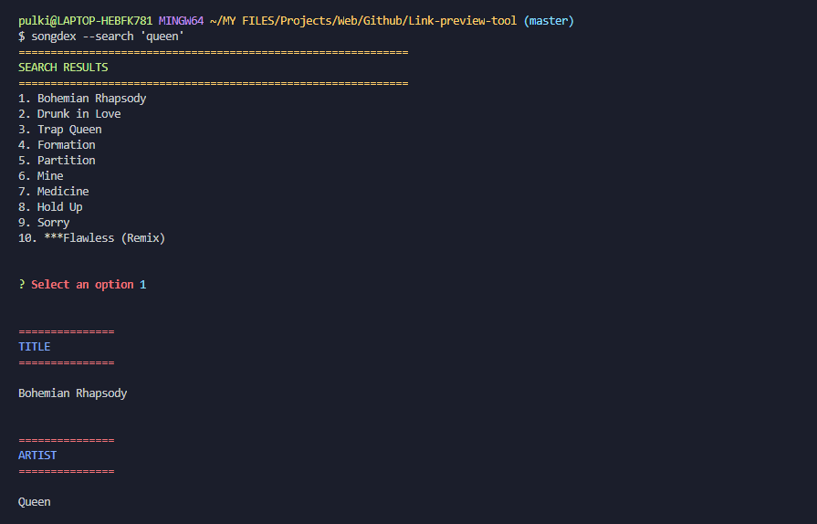
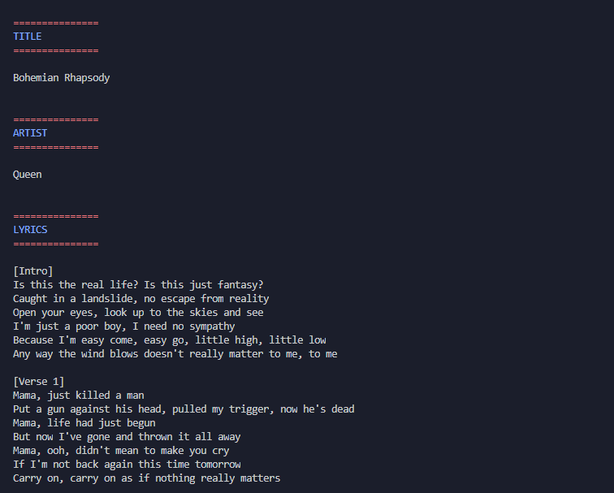

# Songdex

Songdex is a command line application built using javaScript on node js to get information about music tracks like artist, album and lyrics.
<br>
<br>

## Prerequisites :

1. Git - https://git-scm.com/
2. Node JS - https://nodejs.org/
   <br>
   <br>

## Setup :

1. Clone this repository using the following command

```
git clone 'https://github.com/pulkit-jasti/songdex.git'
```

2. Navigate to the project directory and create a global symlink using the following commands

```
cd songdex/
npm link
```

3. Test using the following command

```
songdex --help or --version
```

<br>
If you are getting an error, then try running this command first and then go back to step 3

```
npm link --force
```

<br>
<br>

## Usage :

You can search for a track using Artist/Album/ Track name and get the top 10 most relevant results. Then enter a number to select a track and get the lyrics and more information about it

Search using any of the two commands

```
songdex --search '<track/album/artist>'
```

Or

```
songdex -s '<track/album/artist>'
```

<br>
<br>

## Screenshots :



